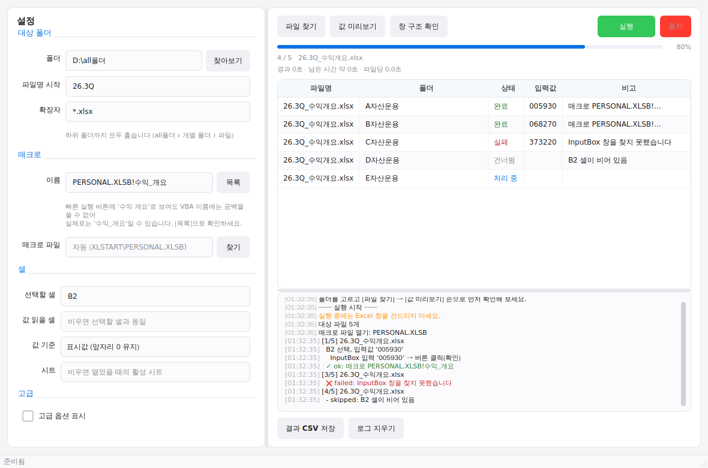

# 엑셀 매크로 일괄 실행 봇

폴더 아래에 흩어져 있는 엑셀 파일을 하나씩 열어서
**셀 선택 → 매크로 실행 → InputBox에 값 입력 → 확인 → 저장**을 자동으로 반복합니다.

```
all폴더/
├── A회사/  26.3Q_....xlsx   ← 대상
├── B회사/  26.3Q_....xlsx   ← 대상
└── C회사/  26.2Q_....xlsx   ← 접두사가 달라 제외
```

GUI와 CLI 두 가지로 쓸 수 있습니다. **처음이라면 GUI를 추천합니다.**



## 설치

```cmd
pip install -r requirements.txt
```

Python 3.9 이상, Windows, Excel 데스크톱 버전이 필요합니다.

## 실행

```cmd
python main.py
```

`run_gui.bat`을 더블클릭해도 됩니다.

## 동작 방식

VBA의 `InputBox`는 **모달 창**이라, 창이 떠 있는 동안 `Application.Run`이 반환되지 않습니다.
그래서 COM 호출만으로는 그 창을 채울 수 없습니다.

이 봇은 **매크로를 실행하기 직전에 감시 스레드를 띄우는** 구조로 이 문제를 풀었습니다.

```
메인 스레드                          감시 스레드
─────────────                        ─────────────
B2 선택
감시 스레드 시작  ──────────────────▶  Excel 프로세스의 창을 폴링
Application.Run(매크로)  ← 블로킹        │
   │                                    ├─ InputBox 발견
   │  (InputBox 떠 있음)                ├─ Edit 컨트롤에 값 입력
   │                                    └─ [확인] 버튼 클릭
   ▼                                          │
반환됨  ◀───────────────────────────────────────┘
저장 → 닫기
```

GUI에서는 이 전체 과정이 다시 백그라운드 스레드에서 돌아가므로 창이 멈추지 않습니다.

---

# 사용법 — 4단계로 진행하세요

처음부터 전체 파일에 돌리지 마시고, **아래 순서대로** 확인하는 걸 권장합니다.

## 1단계. 매크로 정확한 이름 확인 — [목록] 버튼

**매크로 › 이름** 옆의 **[목록]** 버튼을 누르면 Excel을 잠깐 열어
사용 가능한 매크로 이름을 전부 읽어와 드롭다운에 채웁니다.

> **왜 필요한가요?**
> 빠른 실행 도구 모음의 버튼 이름은 `수익 개요`처럼 보여도,
> **VBA 프로시저 이름에는 공백을 쓸 수 없습니다.**
> 실제 이름은 `수익_개요`이거나 전혀 다른 이름일 수 있어요.

<details>
<summary>「VBA 프로젝트에 접근할 수 없습니다」가 나오는 경우</summary>

Excel → **파일 → 옵션 → 보안 센터 → 보안 센터 설정 → 매크로 설정**에서
**「VBA 프로젝트 개체 모델에 안전하게 접근할 수 있음」**을 체크한 뒤 다시 누르세요.

이게 싫으시면 Alt+F11(VBA 편집기)을 열어 직접 이름을 확인하고 손으로 입력하셔도 됩니다.
</details>

## 2단계. [파일 찾기] — 어떤 파일이 잡히는지 확인

폴더를 고르고 **[파일 찾기]**를 누르면 대상 파일이 표에 나열됩니다.
`파일명 시작`(기본 `26.3Q`)과 `확장자`(기본 `*.xlsx`)로 걸러집니다.

폴더 입력칸에는 탐색기에서 **폴더를 끌어다 놓을** 수도 있습니다.

## 3단계. [값 미리보기] — 어떤 값이 들어갈지 확인

매크로를 **실행하지 않고** 파일을 열어 B2 값만 읽어서 표의 `입력값` 열에 보여줍니다.
InputBox에 들어갈 값이 예상과 맞는지 여기서 확인하세요.

## 4단계. [실행]

확인 창이 한 번 뜬 뒤 전체 파일을 처리합니다.
처음에는 **고급 › 처리 개수 제한**을 `1`로 두고 한 파일만 테스트해 보세요.

진행 중에 **[중지]**를 누르면 지금 처리 중인 파일까지만 끝내고 멈춥니다.

---

# 잘 안 될 때

## InputBox에 값이 안 들어감

일부 컨트롤은 `WM_SETTEXT`를 무시합니다.
**고급 › 입력 방식**을 `타이핑 (한 글자씩)`으로 바꿔보세요.

## 「InputBox 창을 찾지 못했습니다」 / 엉뚱한 창을 잡음

**[창 구조 확인]** 버튼을 누르면 첫 파일에서 매크로를 실행해
실제로 어떤 창이 뜨는지 컨트롤 구조를 로그에 덤프합니다.
**저장은 하지 않고** 창을 취소하므로 안전합니다.

```
매크로 'PERSONAL.XLSB!수익_개요' 실행 중 나타난 대화상자:
  창 제목 : '종목아이디를 입력하세요'
  클래스  : #32770
  컨트롤  : 4개
    EDIT   cls=Edit             id=1000   text=''
    BUTTON cls=Button           id=1      text='확인'
    BUTTON cls=Button           id=2      text='취소'
           cls=Static           id=65535  text='종목아이디'
```

창이 여러 개 뜬다면 **고급 › 창 제목 필터**에 제목 일부(예: `종목아이디`)를 넣어 좁히세요.

## 입력값이 `005930`이 아니라 `5930`으로 들어감

기본값(`값 기준 = 표시값`)은 화면에 보이는 그대로를 읽으므로 앞자리 0이 유지됩니다.
그래도 문제가 생기면 셀 서식을 **텍스트**로 바꾸거나,
`값 읽을 셀`에 다른 셀(예: `C2`)을 지정하세요.

## 매크로를 못 찾음

`이름`에 `!`를 포함한 전체 이름(`PERSONAL.XLSB!수익_개요`)을 넣으면 그대로 사용합니다.
`!` 없이 넣으면 봇이 `PERSONAL.XLSB!` 접두사와 공백→밑줄 변형까지 자동으로 시도합니다.

매크로가 PERSONAL.XLSB가 아닌 다른 파일(추가 기능 등)에 있다면
**매크로 파일** 칸에 그 파일 경로를 지정하세요.

---

# 결과 확인

작업이 끝나면 표에 파일별 상태가 남고, 하단에 요약이 표시됩니다.

| 상태 | 의미 |
|---|---|
| 완료 | 매크로 실행 + 입력 + 저장까지 성공 |
| 건너뜀 | 셀이 비어 있거나 미리보기 모드 (저장 안 함) |
| 실패 | 처리 중 문제 발생 — **저장하지 않음** |

**실패한 파일은 저장되지 않습니다.** 원본 그대로 남으므로 원인을 고친 뒤 다시 돌리면 됩니다.
**[결과 CSV 저장]**으로 전체 목록을 파일로 남길 수 있습니다.

설정은 자동으로 저장되어 다음 실행 때 그대로 복원됩니다.

---

# 주의사항

- **실행 전에 Excel을 모두 닫으세요.** 봇은 자동화 전용 Excel 인스턴스를 새로 띄웁니다.
- **실행 중에는 Excel 창을 건드리지 마세요.** 셀 선택과 창 조작이 꼬일 수 있습니다.
- **파일을 덮어쓰기 저장합니다.** 처음 돌리기 전에 `all폴더`를 백업해 두세요.
- 매크로가 **응답 없이 멈추는 경우**(대화상자도 안 뜨고 반환도 안 됨)에는 봇이 개입할 수 없습니다.
  이때는 작업 관리자에서 Excel을 종료해야 합니다. 대화상자가 떴는데 처리에 실패한 경우에는
  봇이 자동으로 창을 취소해 다음 파일로 넘어갑니다.

---

# CLI로 쓰기

GUI 없이 명령줄로도 같은 작업을 할 수 있습니다.

```cmd
REM 1. 매크로 이름 확인
python excel_macro_bot.py --list-macros

REM 2. 값 미리보기
python excel_macro_bot.py --root "D:\all폴더" --dry-run

REM 3. 파일 1개만 테스트
python excel_macro_bot.py --root "D:\all폴더" --macro "PERSONAL.XLSB!수익_개요" --limit 1

REM 4. 전체 실행
python excel_macro_bot.py --root "D:\all폴더" --macro "PERSONAL.XLSB!수익_개요"
```

## 주요 옵션

| 옵션 | 설명 | 기본값 |
|---|---|---|
| `--root` | 대상 최상위 폴더 | (필수) |
| `--macro` | 실행할 매크로 이름 | `수익_개요` |
| `--prefix` | 파일명 접두사 필터 | `26.3Q` |
| `--pattern` | 파일 glob 패턴 | `*.xlsx` |
| `--cell` | 선택할 셀 | `B2` |
| `--value-cell` | 입력값을 읽을 셀 | `--cell`과 동일 |
| `--value-source` | `text`(표시값) / `value`(원본) | `text` |
| `--sheet` | 시트 이름 | 활성 시트 |
| `--limit` | 앞에서 N개만 처리 | 0(전체) |
| `--dry-run` | 매크로 실행 없이 값만 확인 | |
| `--probe` | 대화상자 구조만 덤프 | |
| `--list-macros` | 매크로 이름 목록 출력 | |
| `--input-method` | `settext` / `chars` | `settext` |
| `--dialog-title` | 제목에 이 문자열이 있는 창만 대상 | |
| `--dialog-timeout` | InputBox 대기 시간(초) | 30 |
| `--log` | 결과 CSV 경로 (`none`이면 끔) | 자동 생성 |
| `--keep-open` | 끝나고 Excel을 닫지 않음 | |

`run.bat`은 경로만 채워 더블클릭으로 CLI를 돌리는 배치 파일입니다.

---

# 파일 구성

| 파일 | 역할 |
|---|---|
| `main.py` | GUI 진입점 |
| `gui/window.py` | 메인 윈도우 (설정 폼, 파일 표, 진행률, 로그) |
| `gui/worker.py` | 백그라운드 스레드 (스캔 / 매크로 목록 / 일괄 실행) |
| `gui/widgets.py` | 콘솔·진행률·폴더 입력 위젯 |
| `gui/style.qss` | 스타일시트 |
| `excel_macro_bot.py` | 엔진 + CLI (파일 순회, Excel COM 제어, 감시 스레드) |
| `win_dialog.py` | Win32 창/컨트롤 조작 (텍스트 입력, 버튼 클릭, 창 탐색) |
| `run_gui.bat` / `run.bat` | GUI / CLI 실행용 배치 파일 |

GUI와 CLI는 `excel_macro_bot.py`의 같은 엔진을 공유합니다.
`Auto_Tools`(업무 자동화 매니저)와는 완전히 독립된 프로그램입니다.
